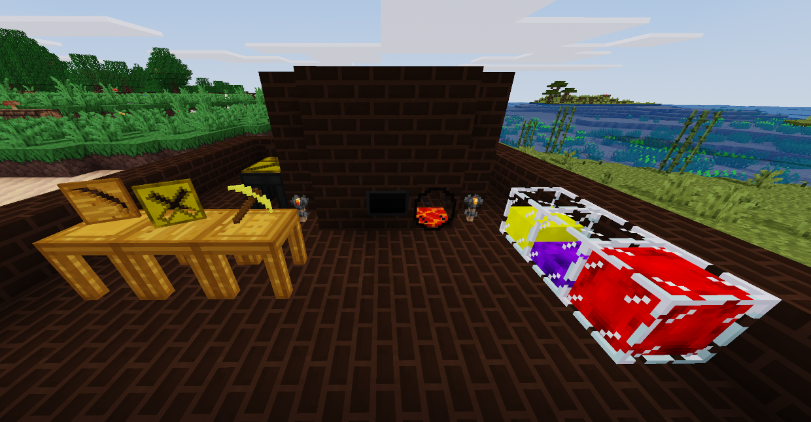

# Melterns

An in-development mod for [Minetest](http://minetest.net) 0.5.0+ that adds molten metals, melting, casting and creating tools. This mod is inspired by the [Tinkers Construct](https://minecraft.curseforge.com/projects/tinkers-construct) mod for Minecraft, however it's much less-featured due to the current limitations of the Minetest API. None of the components used in this mod have been taken from TC - everything is my original creation.

**Depends on [fluid_lib](https://gitlab.icynet.eu/evert/fluid_lib)!**

## Installation
Just do `git clone https://gitlab.icynet.eu/evert/melterns.git` in your `minetest/mods` directory. You can also [download the repository](https://gitlab.icynet.eu/evert/melterns/archive/master.zip) but in that case you **must** change the folder name from `melterns-master` to `melterns`!

## Documentation
Documentation on how to use this mod can be found on [this wiki page](https://gitlab.icynet.eu/evert/melterns/wikis/home). I recommend using a mod that shows you crafting recipes in order to know how to craft the nodes.

## License
The MIT License

See [LICENSE](LICENSE.txt)
