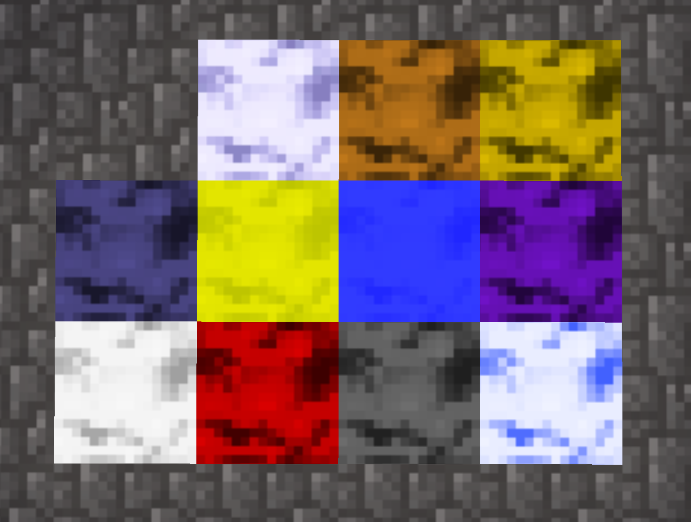
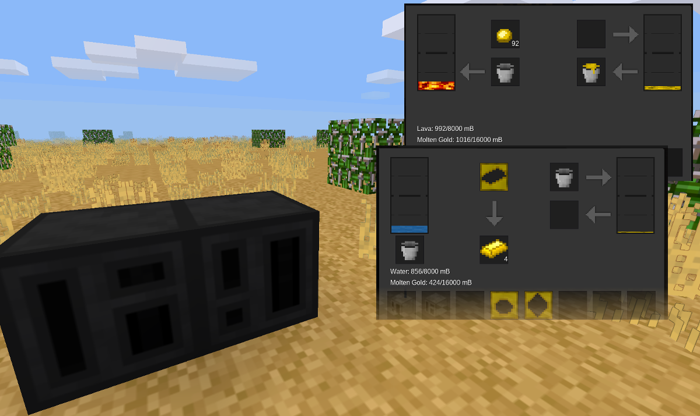
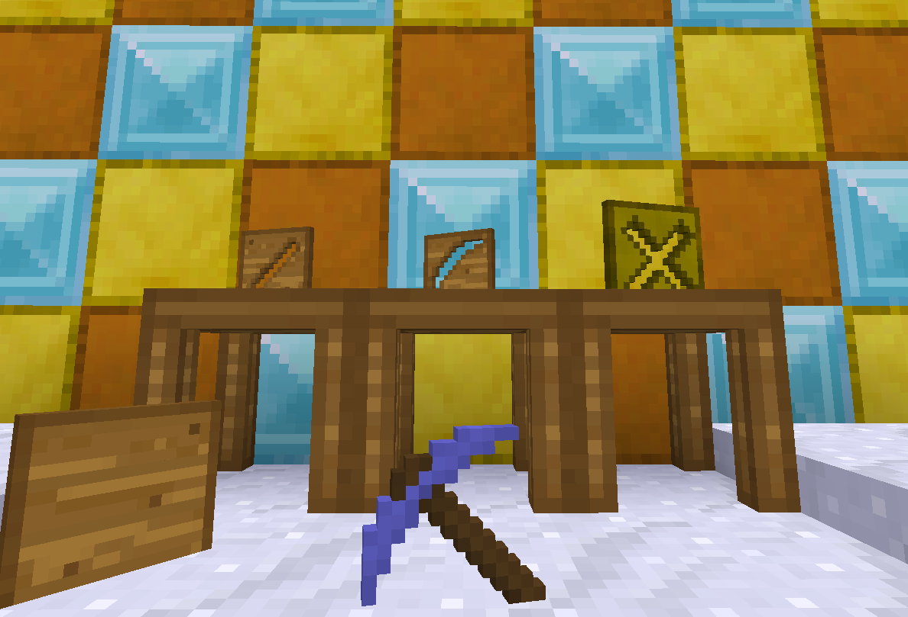

# Melterns
An in-development mod for [Minetest](http://minetest.net) 0.5.0+ that adds molten metals, melting, casting and creating tools. This mod is inspired by the [Tinkers Construct](https://minecraft.curseforge.com/projects/tinkers-construct) mod for Minecraft, however it's much less-featured due to the current limitations of the Minetest API. None of the components used in this mod have been taken from TC - everything is my original creation.

## Component mods
This repository is technically a modpack, in which all mods need to be enabled. These are the mods included in this "modpack".

### fluidity

Fluidity adds molten metals to the game. Supports metals from [default](https://github.com/minetest/minetest_game), [technic](https://github.com/minetest-mods/technic) and [moreores](https://github.com/minetest-mods/moreores).

### metal_melter

Simple metal melting and casting. Used for ore doubling and making tools in `tinkering`.

### tinkering

Mod that lets you combine different materials to create tools.

## License
The MIT License

See [LICENSE](LICENSE.txt)
